# Live Classroom

The teacher-led live class: webcam and screen share, a shared whiteboard, raised hands,
roles and permissions, Adobe Connect–style layouts, a watermark that identifies every viewer,
and screen capture that is blocked or censored. Recording happens on the server only and
feeds the library through the contract in [06-recording-pipeline.md](06-recording-pipeline.md).

Owner: the live-classroom session. Code lives in `services/live`, `packages/tihe_classroom`,
`packages/capture_guard` and `packages/contracts/src/live`.

Decisions behind this document: [ADR-0009](adr/0009-four-platforms-classroom-desktop-first.md)
(platforms), [ADR-0010](adr/0010-classroom-control-plane-websocket-gateway.md) (control plane),
[ADR-0011](adr/0011-live-capture-guard-censor-and-attribute.md) (capture),
[ADR-0012](adr/0012-services-live-client-facing-own-database.md) (service boundary).

---

## 1. Moving parts

```
 Flutter app (tihe_classroom)                       services/live (NestJS)
 ┌──────────────────────────────┐   REST /v1/live   ┌────────────────────────────────┐
 │ join → LiveKit token, ticket │──────────────────►│ classes · sessions · join      │
 │ stage: pods in a layout      │                   │ LiveKit tokens / rooms / egress│
 │ whiteboard · chat · hands    │   WSS /v1/live/ws │ classroom gateway (room actor) │
 │ capture_guard · watermark    │◄─────────────────►│ audit · attendance             │
 └──────────────┬───────────────┘                   └──────┬─────────────────┬───────┘
                │ WebRTC media only                        │ server API       │ Redis
         ┌──────▼──────────┐   room composite (template)   │                  │
         │ LiveKit SFU     │◄──────────────────────────────┘           Postgres tihe_live
         │ + Egress        │──► s3://tihe-raw/recordings/{classId}/{sessionId}/
         └─────────────────┘       composite.mp4 + metadata.json  ──► video pipeline
```

- **LiveKit carries media only**: camera, microphone and screen share. Data channels are
  switched off for everyone (`canPublishData=false`).
- **The gateway carries everything else**: permissions, hands, layout, chat, whiteboard,
  capture reports. It is server-authoritative, so every rule is checked once, on the
  server. See ADR-0010.
- **Media rights are enforced by the SFU**. When a capability changes, the gateway pushes
  `canPublishSources` to LiveKit, so a client that ignores the UI still cannot publish.

## 2. Classes and sessions

A **class** (`cls_…`) is the recurring thing: "Calculus 1, Saturdays 10:00", attached to one
course. A **session** (`ses_…`) is one occurrence of it. The LiveKit room is named after the
session id, so a weekly class never reuses a room.

Session states: `scheduled → live → ended`. The host starts the session, which creates the
room and, if `autoRecord` is on (the default), starts recording immediately. Ending the
session stops recording, closes the room and disconnects everyone.

## 3. Roles and capabilities

| Role | Persian | Who | Default capabilities |
|---|---|---|---|
| `host` | میزبان | the course teacher, admins | everything |
| `cohost` | دستیار | teaching assistants | media, screen, board (+manage), chat, manage participants, change layout |
| `presenter` | ارائه‌دهنده | a student given the stage | media, screen, board (+manage), chat |
| `participant` | شرکت‌کننده | enrolled students | raise hand, chat — plus whatever the room policy allows |
| `recorder` | — | Egress (hidden) | subscribe only |

Capabilities:

| Capability | Persian | Means |
|---|---|---|
| `publish.audio` | میکروفون | publish microphone |
| `publish.video` | دوربین | publish camera |
| `publish.screen` | اشتراک صفحه | publish screen share |
| `whiteboard.draw` | نوشتن روی تخته | add and erase own board items |
| `whiteboard.manage` | مدیریت تخته | erase anyone's items, clear, add/switch pages |
| `chat.send` | ارسال پیام | send chat messages |
| `hand.raise` | بالا بردن دست | raise a hand |
| `participants.manage` | مدیریت شرکت‌کنندگان | mute, lower hands, grant/revoke, remove, change room policy, see capture alerts |
| `roles.assign` | تعیین نقش | change someone's role |
| `layout.change` | تغییر چیدمان | change the stage layout |
| `recording.control` | کنترل ضبط | start/stop recording |
| `class.end` | پایان کلاس | end the session |

**Room policy** (host-editable toggles that apply to the `participant` role only):
`participantsCanUnmute`, `participantsCanStartVideo`, `participantsCanShareScreen`,
`participantsCanDraw`, `participantsCanChat` (on by default), `handRaiseEnabled` (on by
default), `locked` (no new joins below cohost).

**Effective capabilities** = role preset ∪ policy (participants only) ∪ per-user grants −
per-user revokes. Rules, all enforced in `services/live/src/core/capabilities.ts` and tested:

1. A host's capabilities can never be revoked.
2. Nobody can grant a capability they do not hold themselves.
3. You can only change someone of a lower rank (`host > cohost > presenter > participant`).
4. Only `roles.assign` holders change roles, and the last host cannot be demoted.

## 4. Raised hands

- Hands form a queue ordered by the server sequence number at the time of raising, never by
  client clocks.
- A participant lowers their own hand; managers lower anyone's, or all at once.
- **Accepting** a hand ("give the floor") lowers it and adds temporary grants of
  `publish.audio` (and `publish.video` if the host chose "with camera"). The server can mute
  but cannot unmute, so the student's app shows "you may speak" and they unmute themselves.
- **Taking back the floor** removes those grants and mutes the tracks.

## 5. Layouts

A layout is a set of **pods** placed on a 12 × 12 grid. Pod kinds:

| Kind | Persian | Content |
|---|---|---|
| `speaker` | ارائه‌دهنده | the host / active speaker, large |
| `gallery` | تصاویر | camera grid of everyone publishing video |
| `screen` | اشتراک صفحه | the current screen share |
| `whiteboard` | تخته سفید | the shared board |
| `chat` | گفتگو | chat |
| `participants` | شرکت‌کنندگان | participant list with roles and controls |
| `hands` | دست‌های بالا | the raised-hand queue |

Coordinates are measured from the **start edge**, so a layout written once renders correctly
in RTL, where the start edge is on the right. Validation rules: every pod lies inside the
grid, no two pods overlap, ids are unique, each kind appears at most once, and there are
between 1 and 8 pods.

### Recommended layouts

| Key | Name | Pods (x, y, w, h) | For |
|---|---|---|---|
| `lecture` | سخنرانی | speaker 0,0,8,12 · chat 8,0,4,7 · participants 8,7,4,5 | talking-head lectures |
| `presentation` | ارائه | screen 0,0,9,12 · speaker 9,0,3,4 · chat 9,4,3,8 | slides, software demos |
| `whiteboard` | تخته سفید | whiteboard 0,0,9,12 · speaker 9,0,3,4 · chat 9,4,3,8 | solving problems by hand |
| `discussion` | گفتگو | gallery 0,0,9,12 · chat 9,0,3,7 · hands 9,7,3,5 | seminars, group talk |
| `split` | ترکیبی | screen 0,0,6,8 · whiteboard 6,0,6,8 · speaker 0,8,3,4 · gallery 3,8,6,4 · chat 9,8,3,4 | annotating alongside slides |
| `qa` | پرسش و پاسخ | speaker 0,0,7,8 · gallery 0,8,7,4 · hands 7,0,5,5 · chat 7,5,5,7 | end-of-class questions |

The host (or anyone with `layout.change`) picks a preset or applies a custom layout from the
layout editor. Everyone's stage follows it. Custom layouts are saved per teacher
(`/v1/live/layouts`). A viewer can still maximise a pod on their own screen; that is local
and never synced.

**Small screens** (phones, under 600 logical pixels wide): the layout collapses to its largest
media pod, with the other pods behind a tab bar.

**Recording layout**: Egress renders the same layout **minus** the chat, participant and
hands pods, so no student names end up in the library video. The largest remaining media pod
takes the main area and the rest stack in a side column
(`deriveRecordingLayout` in `packages/contracts/src/live/layout.ts`, shared by the service and
the Egress template).

## 6. Whiteboard

- **Pages**: a board has pages (plain, grid, lined or dotted backgrounds); the active page is
  synced. Page space is 16:9, stored as integers in `0..16000 × 0..9000`, so a stroke looks
  the same at any window size.
- **Tools**: pen (خودکار), marker (ماژیک), highlighter (ماژیک فسفری, translucent), eraser
  (پاک‌کن — removes whole items), line, arrow, rectangle, ellipse, text, and laser pointer
  (لیزر — ephemeral, fades, never stored). Eight palette colours plus custom; widths in page
  units (1–640); optional fill for shapes.
- **Sync**: while drawing, the client sends `wb.progress` batches about every 40 ms. They are
  relayed to others as a live preview, never stored, and may be dropped under backpressure.
  On pen-up it sends `wb.add` with the finished item, which the server sequences and
  persists.
- **Undo/redo** is per user and implemented as inverse operations (`wb.remove` ↔
  `wb.restore`), so it never disturbs anyone else's work.
- **Ownership**: `whiteboard.draw` lets you erase your own items only; `whiteboard.manage`
  erases anything, clears pages and switches pages for everyone.
- **Rendering**: strokes are outlined with the perfect-freehand algorithm — `perfect_freehand`
  in Dart, `perfect-freehand` in the Egress template — so the recording matches the live
  board.
- **Text direction**: each text item takes its direction from its first strong character, so
  a Persian note reads right to left and a formula like `f′(g(x))` reads left to right in
  both. Either way it is right-aligned at its anchor, `at`, which is the item's top-right
  corner. The rule is `textDirectionOf`, in both the Flutter painter and the template.
- Limits: 2000 points per stroke (the client splits longer ones), 10 000 items per page, 500
  characters per text item.

## 7. Webcam, microphone and screen share

- Camera and mic via `livekit_client` with simulcast and adaptive streaming, so a 100-person
  gallery only receives the resolutions actually on screen. Device pickers on desktop; front
  and back cameras on mobile.
- **Screen share**:
  - **Windows / macOS**: a picker listing screens and windows, with thumbnails. The classroom's
    own window is left out of the list. On macOS the picker defaults to "window", because a
    full-screen share would show the classroom inside itself (see §8).
  - **Android**: MediaProjection with the required foreground service
    (`FOREGROUND_SERVICE_MEDIA_PROJECTION` on Android 14+).
  - **iOS**: a Broadcast Upload Extension (ReplayKit) sharing the app group with the app.
  - **Quality**: 1080p at up to 30 fps, capped at 3 Mbps (LiveKit's preset allows 5; many
    teachers' uploads cannot carry that). When bandwidth runs short, WebRTC keeps a screen
    share's resolution and drops frames instead, so slide text stays sharp.
- **Known gap**: native `livekit_client` does not capture system audio with a screen share. A
  teacher playing a clip must route audio through a virtual audio device into the microphone
  for now. A native loopback plugin (WASAPI on Windows, ScreenCaptureKit audio on macOS) is
  the planned fix.

## 8. Capture protection — "screen recording is banned"

Policy: **block where the OS allows it, detect where it doesn't, censor on detection, alert
the host, and watermark always**. Full reasoning in ADR-0011.

| Platform | Block | Detect | What a recording shows |
|---|---|---|---|
| Windows | `SetWindowDisplayAffinity`: `WDA_MONITOR` for students, `WDA_EXCLUDEFROMCAPTURE` for presenters | known recorder processes; Remote Desktop session | students' window: **black box**; presenters' window: absent from their own share |
| macOS | `NSWindow.sharingType = .none` | known recorder processes; `screencaptureui` | macOS ≤ 14: window blank. **macOS 15+: ScreenCaptureKit ignores `sharingType`, so detection + censor is the only barrier** |
| Android | `FLAG_SECURE` while the classroom is on screen | Android 15 screen-recording callback, Android 14 screenshot callback | black |
| iOS | secure-layer rendering (behind a server flag) | `sceneCaptureState` / `isCaptured`, screenshot notification, external screens | censored layer |

**On detection** the student's classroom is replaced by the censor screen ("ضبط صفحه در
کلاس مجاز نیست"), and remote audio is muted too (`censorAudio`) — pixel blocking never covers
audio. The app reports `capture.report` to the gateway, which writes an audit event and alerts
everyone with `participants.manage`. The content comes back when recording stops. No
auto-kick; the host decides.

**Self-capture is not an offence**: a presenter's own screen share uses the same OS machinery
(MediaProjection, ReplayKit, desktop capture). The client suppresses detection while its own
share is active and, on iOS, only when there is a single screen (AirPlay mirroring also sets
"captured").

The recorder-process list and flags come from the server in the join response, so they can
be tuned without an app release.

## 9. Watermark

- **Text**: masked phone and short account id, plus the current time — `0912•••6789 ·
  #48213 · 14:32`. The id and time use ASCII digits so OCR on a leaked copy is reliable.
  `watermarkShortId` in contracts derives the short id, and the M6 leak-lookup tool uses the
  same function.
- **Placement**: a corner of the **stage** (not the window, since a camera aimed at the slides
  would crop the window corners). It jumps to another corner at seeded random intervals (the
  existing `watermarkSchema` with `movement: 'corners'`), so cropping one corner never removes
  it.
- **Rendering**: a Flutter overlay above the stage. In the classroom the video is a Flutter
  texture, so a Dart overlay sits above it exactly as a native layer would (ADR-0011).
- **Privacy**: the phone number is never placed in LiveKit metadata or attributes, which
  every participant can read. It goes only to its owner, in their own join response.
- **Recordings** carry an institute mark instead. Viewer identity is added by the player when
  a recording is watched.

## 10. Recording

Server-side Egress only; the app has no recording path. Egress renders
`services/live/egress-template` — the same layout (minus private pods), the whiteboard and
the institute mark — and writes to the path fixed in docs/06. A pulsing red "در حال ضبط" pill is
visible to everyone while recording.

Ordering that matters for the pipeline:
1. `metadata.json` is written at egress start and rewritten with `actualEndAt` and
   `participantCount` **before** `stopEgress` is called, so ingest never reads a stale copy.
2. Egress cannot pause. Stopping and starting again would overwrite `composite.mp4`, so v1
   records the whole session. Multi-part recordings need a contract change (docs/06).

## 11. Look and language

- Persian, right-to-left, everywhere in the classroom: Persian digits in the UI, Jalali dates,
  and Persian error messages from `messageFa`.
- **Font: Peyda.** Drop the TTF/OTF files into `packages/tihe_classroom/assets/fonts/` (see the
  README there). They are discovered and registered at runtime, so the build works before the
  files exist; until then the classroom falls back to the platform font. Flutter cannot load
  WOFF/WOFF2.
- **Glass, in light and dark.** The classroom is layers — pods over the stage, the dock and
  sheets over pods — and frosted glass keeps each layer's place readable without heavy borders
  or shadows:
  - Canvas: a near-flat colour with three soft glows, painted once, so the blur has something to
    refract but nothing competes with the class.
  - Panes: every pod, the top bar and the dock are frosted glass with a lit one-pixel rim. The
    stage's panes share one `BackdropGroup`, so seven pods cost one blur; overlays (toasts,
    sheets) blur on their own.
  - Media: video and screen share sit on an inset dark screen in both themes. The whiteboard page
    stays near-white in both — ink colours are chosen for it and it is what Egress records.
  - Controls: a centred dock of glass keys. A muted microphone or camera is red and crossed out,
    so it is never mistaken for a live one; a locked control shows a padlock; a raised hand turns
    amber with its place in the queue; "end class" is the one solid red key.
  - Status: pills with a dot — green for live, pulsing red for recording, amber while
    reconnecting.
  - Icons: Lucide, the same set as the video player; the accent, neutrals and status colours
    match the player too, so the two apps read as one product.
- **Light and dark.** `ClassroomPage` follows the host app's theme unless given a `brightness`;
  a switch in the top bar flips it for the rest of the class and reports the choice through
  `onBrightnessChanged`, so the host app can remember it.
- **Motion.** Things move only when something happens, never on a loop (except the live and
  recording lamps). Short and eased: 140 ms for presses and small flips, 260 ms for arrivals,
  380 ms for moves across the stage; arrivals start quick and settle, departures leave fast.
  - Stage: the first layout of a class arrives pod by pod. On a layout change, pods glide to
    their new places, new pods fade in, and dropped ones fade out. Maximise zooms a pod over the
    stage while the rest fade, and they stay mounted, so chat scroll and video survive. On
    phones, tabs cross-fade.
  - Arrivals: toasts drop in under the top bar; chat messages and raised hands slide into their
    lists; history that was already there when the pod opened does not replay.
  - Controls: keys lift on hover and spring back after a press; mic and camera icons
    cross-fade when they flip; the hand waves when raised, and its queue number pops in. The
    online count rolls to its new value.
  - Dialogs rise and sharpen into place; opening a class fades it in from slightly larger.
  - The censor screen is the exception: it replaces the class instantly, since any frame of a
    fade would show the class to the recorder.
  - The operating system's reduce-motion setting turns all of this off (`Motion` in
    `motion.dart`).
- **Frame rate.** The classroom runs at the display's refresh rate (60, 120 or 144 Hz):
  - Anything that updates alone gets its own layer, so its update repaints nothing else: each
    pod, the watermark, and the live clock.
  - The whiteboard is two layers. Finished items are drawn once, and redrawn only when an item
    comes or goes. Ink in motion (your stroke, others' previews, the laser) is redrawn every
    frame on its own. Drawing on a full page costs one stroke per frame, not the whole page.
  - Other people's strokes arrive in 40 ms batches (§6). Each batch is revealed across the next
    40 ms at the display's rate, so remote ink glides instead of stepping 25 times a second.
  - Frames stop when nothing moves.
  - Android phones often hold apps at 60 Hz unless they ask for more, so the app asks for the
    display's fastest mode. iOS allows ProMotion through `CADisableMinimumFrameDurationOnPhone`.
- The theme lives in `tihe_classroom/lib/src/ui/theme/`: tokens in one `ClassroomTheme` object
  (`ClassroomTheme.light` / `.dark`), the glass controls in `glass.dart`, and motion in
  `motion.dart` and `transitions.dart`.

## 12. Manual device checklist

These cannot run in CI. Run them before each release on real hardware.

| # | Platform | Steps | Expected |
|---|---|---|---|
| 1 | Windows 10 2004+ / 11 | Student joins; OBS "Display Capture" and "Window Capture" | black box where the classroom is |
| 2 | Windows | Snipping Tool screenshot and screen recording | black box |
| 3 | Windows | Start OBS while in class | censor screen within 3 s, host sees alert |
| 4 | Windows | Presenter shares full screen | the classroom window is absent from the share, not a black box |
| 5 | Windows | Join over Remote Desktop | censor screen |
| 6 | macOS 14 | Cmd-Shift-5 window/screen recording | classroom blank |
| 7 | macOS 15+ | Cmd-Shift-5, QuickTime, OBS | censor screen + host alert (window itself is **not** blank — known limit) |
| 8 | Android 14/15 | Built-in screen recorder, screenshot | black; host alert on 15 |
| 9 | Android | Presenter shares screen | no self-alert; foreground notification shown |
| 10 | iOS 17+ | Control Centre recording; AirPlay mirror | censor screen + host alert |
| 11 | iOS | Presenter broadcast extension | no self-alert while sharing |
| 12 | all | Revoke mic from a speaking student | track muted within 1 s; re-publish refused |
| 13 | all | Watermark | visible on the stage and changing corners; masked phone correct |
| 14 | all | Kill network for 10 s, restore | gateway resumes and the board, hands and chat are intact |

## 13. What it looks like

These are rendered by the opt-in screenshot test in `packages/tihe_classroom`, using
Vazirmatn in place of Peyda until the Peyda files are added.

| | |
|---|---|
| 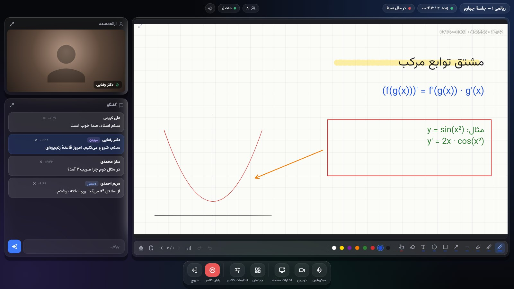 | 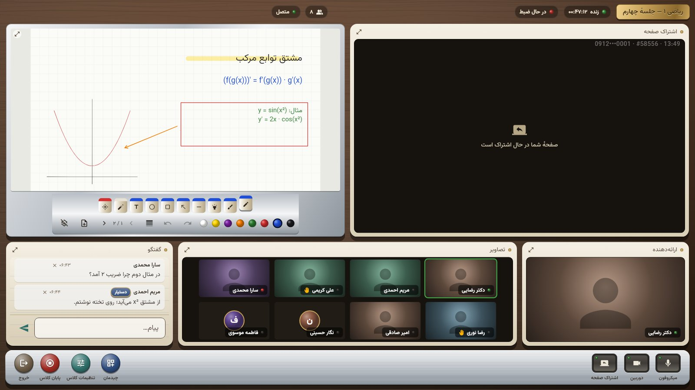 |
| Whiteboard layout: the marker tray, pages, and a raised-hand alert | Split: screen share next to the board |
| 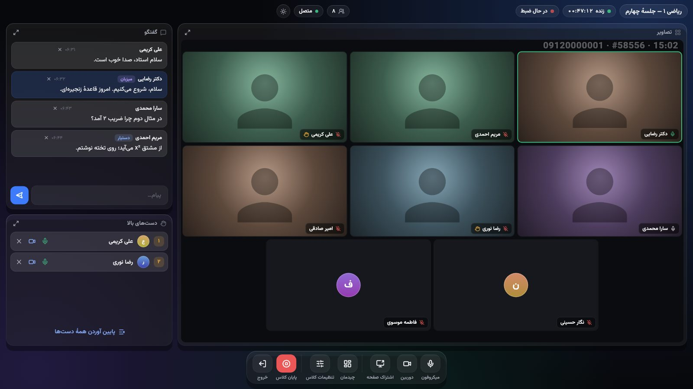 | 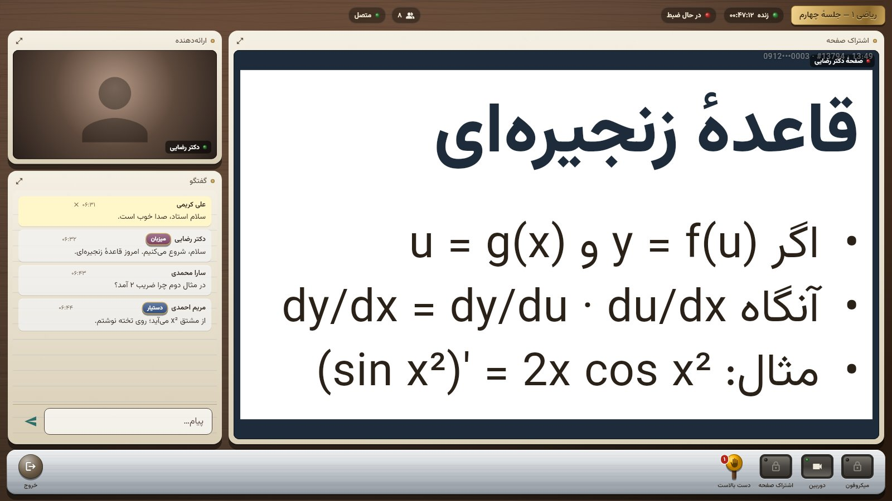 |
| Discussion: gallery, chat, hands queue | A student's view: the watermark sits in a stage corner |
| 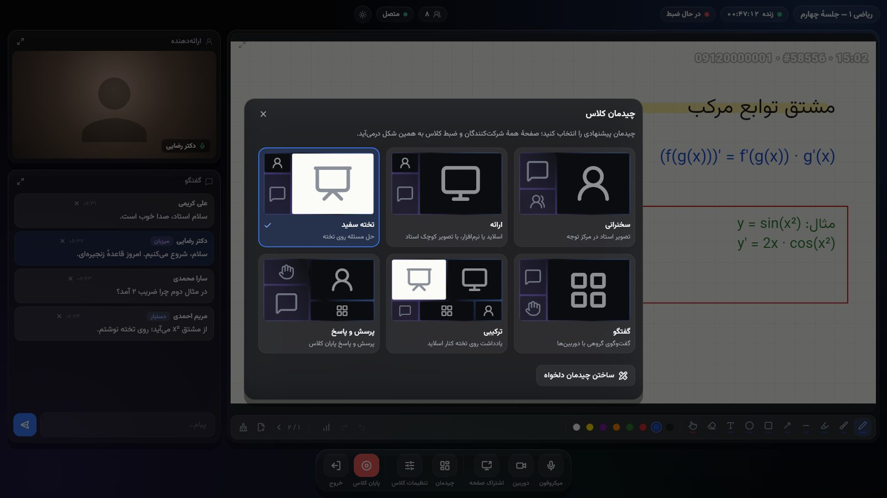 | 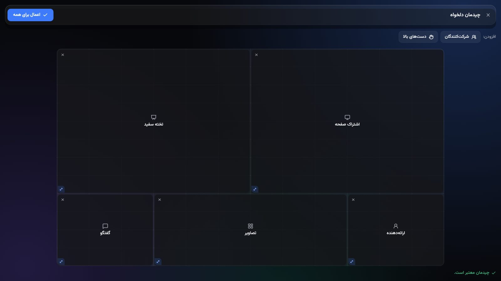 |
| The six recommended layouts | The layout editor on the 12 × 12 grid |
| 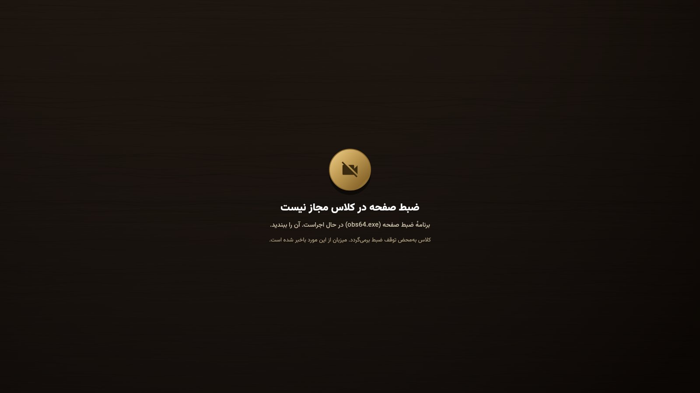 | 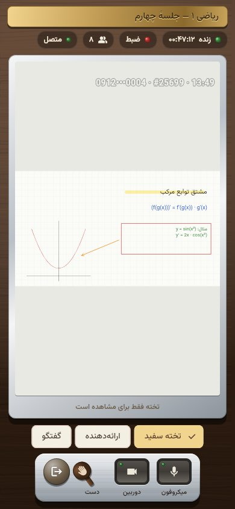 |
| A student's classroom while a recorder runs | Phone width: the largest pod plus tabs |
| 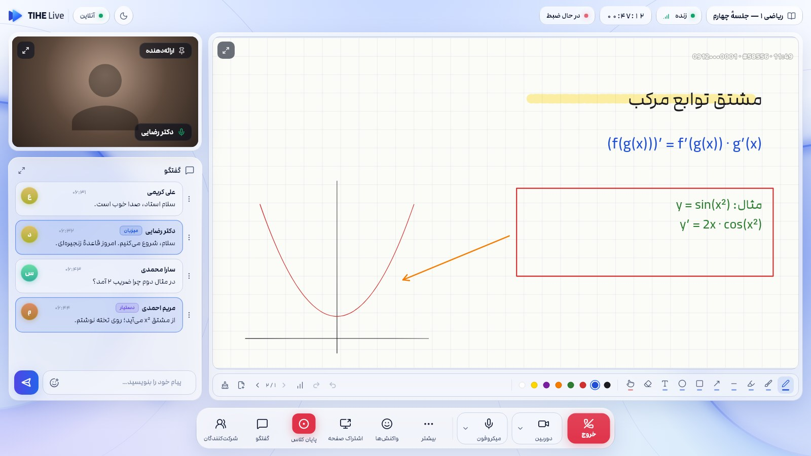 | 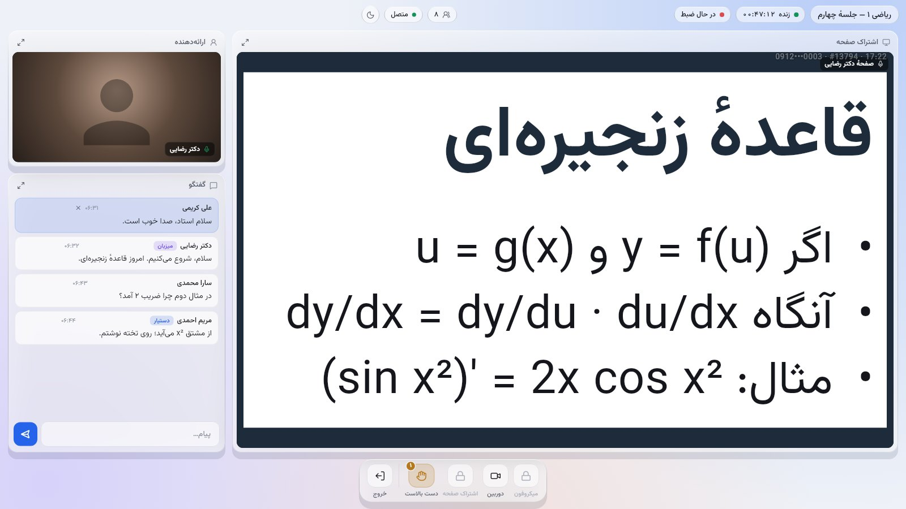 |
| The light theme: the same glass over a pale canvas | A student's view in light |
| 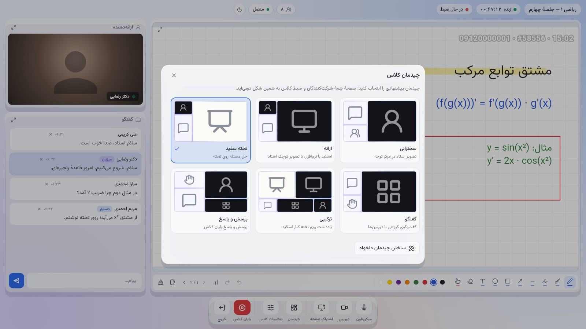 | 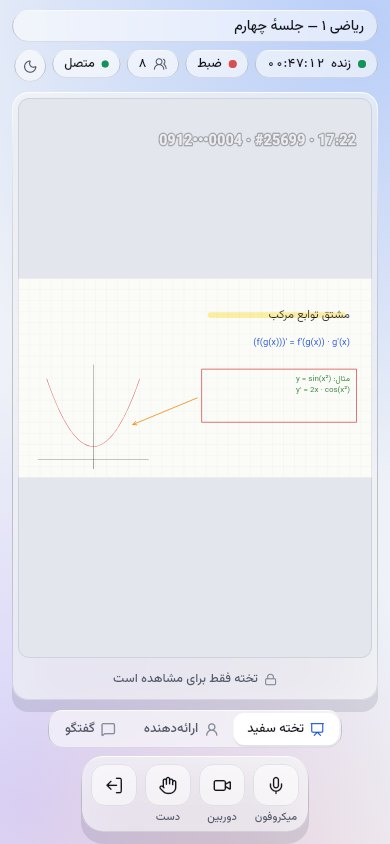 |
| The layout picker in light | Phone width in light |

## 14. Running it end to end

To drive a class by hand:
1. Start services/live in memory (see `services/live/README.md`).
2. Mint a teacher token and a student token with `dev-token`.
3. Create and start a class over REST.
4. Join from the example app (`packages/tihe_classroom/README.md`).

**Verified in a container**, with:
- real `livekit-server` 1.13
- services/live built and running in memory
- the example app as a Linux desktop build

What worked:
- Creating and starting a class created a LiveKit room named after the session.
- Starting the class asked Egress to record, with the template URL and the
  `recordings/{classId}/{sessionId}/composite.mp4` path.
- With no Egress worker running, the request timed out, and the session logged
  `recordingError` rather than failing.
- The app joined the gateway, and the teacher saw the student come online.
- The gateway acknowledged every command the teacher sent.
- A change to the room policy reached the student as a participant update.

Not verified there:
- **The app's media connection.** `livekit_client` on Linux needs NetworkManager over D-Bus,
  which the container lacks.
- **Screen rendering under Xvfb.** The virtual display stopped repainting, so the app's
  screens were checked with the widget tests and the screenshot test instead.

Both need a real desktop, and the device checklist in §12 covers the rest.
