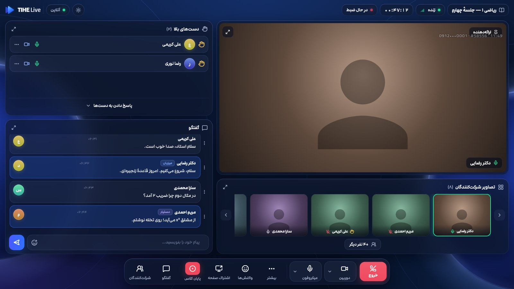
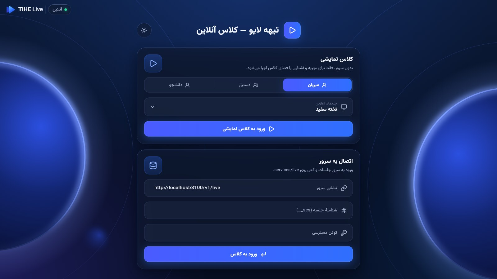

# tihe_classroom

The TIHE Live classroom as a Flutter package. It covers:
- the stage and its layouts
- webcam and screen share
- the whiteboard
- raised hands and access levels
- capture censoring
- the identity watermark

The UI is in Persian, right to left, in Modam: navy glass over a night sky with lit planets,
in dark and light. It follows the host app's theme unless given `brightness:`, and a switch in
the class's top bar flips it (reported through `onBrightnessChanged:`). The pointer is the TIHE
glow cursor. Design and rules: [docs/11-live-classroom.md](../../docs/11-live-classroom.md) §11.



## Use it

```dart
import 'package:tihe_classroom/tihe_classroom.dart';

final session = await openClassroom(
  liveApiBaseUrl: 'https://api.tihe.ir/v1/live',
  accessToken: auth.freshAccessToken,     // the API's access token, refreshed by the app
  sessionId: 'ses_01J8Z…',
);
// classroomRoute fades the class in from slightly larger; any route works.
Navigator.of(context).push(classroomRoute(
  context,
  (_) => ClassroomPage(session: session, onExit: (_) => Navigator.of(context).pop()),
));
```

If the class refuses the join (not enrolled, not started, locked, full, removed),
`openClassroom` throws `ApiError`, and `messageFa` holds the Persian message to show.
`ClassroomPage` owns the session: it opens it and disposes it.

Two optional pieces go at the app's root, in `MaterialApp.builder`:
- `GlowCursorScope`: the glow cursor over the whole app, dialogs included. On Windows the
  classroom shows it without the scope too (it is a real system cursor there); on macOS and
  Linux the scope is what draws it, and without one the system arrow stays.
- `WindowChrome`: for an app that hides the system title bar (the example does on Windows). Its
  window buttons then sit in the classroom's top bar, and dragging the bar moves the window.

## Inside

```
lib/src/contracts/   Dart mirror of packages/contracts/src/live, checked against its JSON fixtures
lib/src/data/        LiveApi (REST), GatewayClient (WebSocket, reconnect + replay), media port
                     with LiveKit and fake implementations
lib/src/domain/      ClassroomState and its reducer, board model, stage geometry, watermark
                     hopper, Persian digits and Jalali dates
lib/src/state/       ClassroomSession (gateway + media + capture guard), BoardController, providers
lib/src/ui/          theme (tokens, sky and glass controls, mark and window frame, menus,
                     cursor, Modam loader), stage and pods, whiteboard, bars and layout editor,
                     censor screen, watermark
lib/src/demo/        an in-process gateway and a fixture class, for the demo and the tests
```

The server is authoritative, so the client never decides a rule on its own. It sends
commands and applies the events the gateway sends back. Where the UI acts before the server
confirms (whiteboard strokes), the action is marked pending until the matching event arrives.

## Modam

The typeface is Modam, in [`assets/fonts/`](assets/fonts/README.md), registered at runtime as
the family `Modam` by `ClassroomFonts`. `ClassroomPage` loads it on its own; an app can call
`ClassroomFonts.ensureLoaded()` before `runApp` so its first frame is already in Modam, as the
example does. Modam is a commercial font (FontIran): the institute's licence must cover it.

## Run the example

```bash
cd packages/tihe_classroom/example
flutter run -d macos        # or windows, android, ios, linux
```



The launcher offers:
- **Demo**: an offline class. Pick a role (host, co-host, student) and a starting layout.
  An in-process gateway plays the other side, so hands, chat, reactions, the board and
  permissions all work without a server.
- **Server**: join a real `services/live` session. Give the base URL, the session id and an
  access token. Setting `TIHE_LIVE_URL`, `TIHE_SESSION` and `TIHE_TOKEN` joins straight away.
  Against a local services/live, mint tokens with
  `pnpm --filter @tihe/live dev-token <userId> <role>` (users are in
  `services/live/dev/directory.json`).

The lamp beside the mark checks the server's `/health` every 20 seconds and whenever the
address changes, so "آنلاین" means the classes can actually be reached. On Windows the app draws
its own title bar (with `window_manager`), so the launcher's and the class's top bars are the
window's.

On Linux, `livekit_client` checks connectivity through NetworkManager over D-Bus. Without it,
as in containers, the gateway works but joining the media room fails. The desktop targets
that ship are Windows and macOS.

## Install on Windows

`.github/workflows/windows-installer.yml` builds the app on a Windows runner and wraps it in a
Persian setup wizard, `TIHE-Live-Setup-<version>.exe` (Inno Setup,
[`installer/windows/tihe_live.iss`](example/installer/windows/tihe_live.iss)). The workflow
runs on pull requests that touch the classroom (download the `.exe` from the run's
**Artifacts**), and on every merge to `main` and every `live-v*` tag, which publish a GitHub
release — see **Updates** below. Once the workflow is on
`main`, it can also be started by hand from the Actions tab (**Run workflow**, with an
optional version); GitHub only offers that for workflows on the default branch.

The wizard:
1. welcome
2. install folder (per user, no administrator needed)
3. **class server address**, pre-filled with the repository variable `TIHE_LIVE_URL`
4. desktop shortcut
5. install and start

It needs Windows 10 version 2004 or later, the first release that can hide a window from
screen capture. The Visual C++ runtime is bundled, and every build runs
[`check-dependencies.ps1`](example/installer/windows/check-dependencies.ps1): it reads what
each bundled `.exe` and `.dll` imports and fails if a DLL loaded at start-up is neither in the
bundle nor part of Windows. Uninstall from Windows Settings → Apps.

For IT staff: `TIHE-Live-Setup-0.1.0.exe /VERYSILENT /server=https://…` installs with no
questions.

### Updates

Install once; after that the app keeps itself up to date
([`example/lib/updater.dart`](example/lib/updater.dart)):

1. Every merge to `main` that touches the classroom is built and published as a release,
   `live-v<major.minor>.<run>` (major.minor from `example/pubspec.yaml`), with
   `tihe-live-update.json` beside the `.exe`: the version, the download link and its SHA-256.
2. On start, and every three hours while open, the app reads that file from the latest
   release. A newer version is downloaded in the background into
   `%LOCALAPPDATA%\TIHE Live\updates` and kept only if its SHA-256 matches.
3. The start page then offers **نصب و اجرای دوباره**. If nobody presses it, the update is
   installed the next time the app opens, before its window shows. Either way the wizard runs
   with `/SILENT` — a progress bar, no questions, the last server address kept — and starts
   the app again. A copy installed for all users is updated for all users (Windows asks for
   permission); if that is refused, the app opens as usual and offers the update again rather
   than retrying on every start.

Only downloads from this repository's releases over HTTPS are installed. The app reads the
releases without signing in, so **the repository must be public**. A development build
(`flutter run`, or `flutter build` without `--dart-define=TIHE_APP_VERSION=…`) never updates
itself. Before tagging a release by hand, raise the minor version in `example/pubspec.yaml`,
so the tag is newer than the builds of `main` already out.

The installer is **not code-signed yet**, so Windows SmartScreen warns on first run ("Windows
protected your PC" → **More info** → **Run anyway**). Signing needs a code-signing
certificate in the institute's name; add it to the workflow as a secret when there is one.

To build it by hand on a Windows PC with Flutter, Visual Studio (C++ desktop) and
Inno Setup 6.5+:

```powershell
cd packages\tihe_classroom\example
flutter build windows --release
installer\windows\check-dependencies.ps1 -Bundle build\windows\x64\runner\Release -BundleVcRuntime
iscc /DDefaultServer=https://your-server/v1/live installer\windows\tihe_live.iss
# → installer\windows\Output\TIHE-Live-Setup-0.1.0.exe
```

## Test it

```bash
flutter analyze
flutter test                # contracts conformance, reducers, gateway client, session, board,
                            # page, cursor
(cd example && flutter test)   # the launcher
```

The screenshots in `docs/images/classroom/` come from opt-in tests, here and in the example.
They are set in Modam from the package's assets. Tests have no platform fonts, so give a
fallback (Vazirmatn) for the few characters Modam lacks ("…", "·", "²"):

```bash
TIHE_SCREENSHOTS=1 TIHE_FONT_DIR=/path/to/vazirmatn flutter test test/screenshots --update-goldens
(cd example && TIHE_SCREENSHOTS=1 TIHE_FONT_DIR=/path/to/vazirmatn flutter test --update-goldens)
# PNGs land in test/screenshots/goldens/ and example/test/goldens/ (git-ignored); convert to
# JPEG for docs/images/classroom/
```
